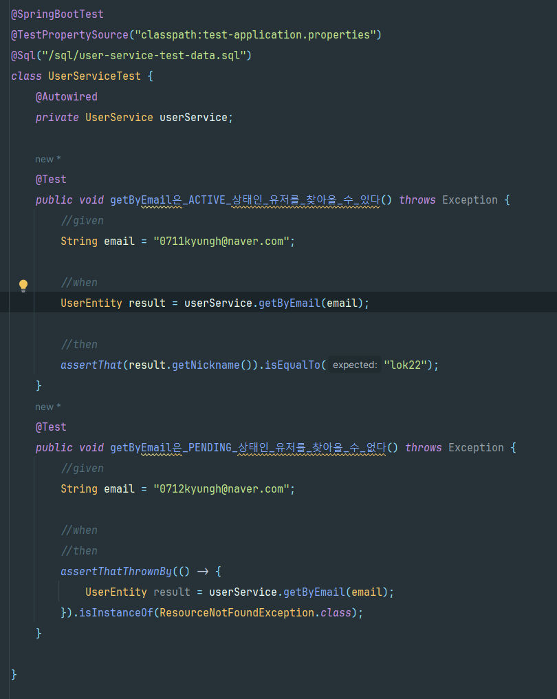
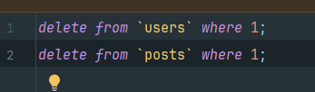
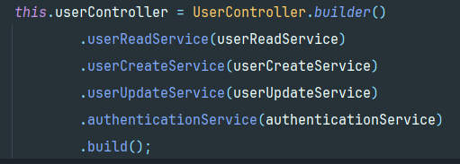

# Toy for test on spring!

해당 레포지토리는 테스트 코드 추가를 위한 토이 프로젝트 입니다.
코드가 얼마나 정상 동작하는지, 프로덕션에서 잘 동작하는지를 검증하지는 말아주세요.
스프링에 테스트를 넣는 과정을 보여드리기 위해 만들어진 레포지토리입니다.
당연히 완벽하지 않습니다.

## 실행하기

### 00. 바로 시작

h2를 이용하여 `auto create table`을 하고 있기 때문에 바로 실행이 가능합니다.

### 01. 이메일 인증

> 단 이 프로젝트는 사용자가 가입할 때 이메일 인증을 하기위해 메일을 발송하는 코드가 있습니다.

이메일이 제대로 발송되는지 확인해보고 싶으신 분들은 [해당 document 파일](./document/connect-mail-sender.md)을 따라해주세요.
관련된 자료는 라이브러리나 Gmail 정책에 따라 UI와 방법이 달라질 수 있습니다.
최신화 된 정보를 제공하지 않으니, 가급적 문서를 참조해주시고, contribution 해주시면 감사하겠습니다.

## 관리 도구로 바로가기

- [h2-console](http://localhost:8080/h2-console)
- [Openapi-doc](http://localhost:8080/swagger-ui.html)


* ### jpa와 h2 연결 테스트

* ### sava하는 코드들 중복


* 해결

* ## UserService 리팩터링
  * ### get은 애초에 데이터가 없으면 에러를 던진다는 의미가 내포되어 있음
    * 
    * 
* ## UserServiceTest
  * ### 두번쨰 테스트 진행시 데이터가 이미 있어서 충돌 발생 
    * 
  * ### Repository 테스트에서는 @DataJpaTest가 자동으로 롤백해줬기 때문에 가능했던것
  * ### 해결 -> @SqlGroup 사용
    * #### @SqlGroup에서는 Sql 파일을 여러 개 지정해서 실행시킬 수 있음
    * 
    * 
  * ### JavaMailSender를 더미로 대체
    * #### SimpleMailMessage를 사용하는 send가 호출돼도 아무것도 하지말라는 코드
      * 
    * #### JavaMailSender라는 Bean객체를 Mock으로 선언된 객체로 덮어쓰기 하는것
      * 

  * ### ObjectMapper
    * 
    * 

* ## UserCreateDto, UserUpdateDto들은 Service패키지에서 참조해야 하므로 domain패키지로 이동
* ## UserRepository를 infrastructure에 두면 상위 모듈인 service에서 infrastructure인 패키지에 의존하는 그림이 되게 되는데 그렇게 되면 안되기 떄문에
  * ### -> service 쪽으로 이동
  * ### service에서 사용하는 인터페이스들을 port패키지에 몰아 넣어줌
* 
  * ### MailSender를 주입해줘야하는데 fake로 만들어줌
  * ### 실제로 어떤 값이 들어왔는지 볼 수 있게 멤버변수 선언
    * 
    * 
* ## 도메인과 영속성 객체를 구분해서 우리의 시스템을 외부 시스템과 완전히 독립적이게 구성이 가능
  * ### User 도메인에서 영속성 객체로 바꿔주는 방법 -> X 도메인은 인프라 레이어의 정보를 모르는 것이 좋기 때문
    * 
    * 
  * ### 로그인 로직 -> 저장까지 진행 why? 변경한 객체가 도메인 객체이기 때문에
    * #### 원래는 Transactional로 묶여있어서 jpa가 알아서 변경된 엔티티를 감지하고 수정하는데 jpa와의 의존성이 끊어지면서 변경감지를 못함
      * 
      * 
  * ### 컨트롤러가 Http 응답으로 맵핑해주는 로직을 들고 있는게 부자연스러움 -> 응답 객체에 책임을 넘겨줌
    * 
    * #### Setter를 제거해주고 Builder 애노테이션을 추가
      * 
    * #### 컨트롤러 간에 있던 이상한 의존성도 사라짐
      * 
* ## 도메인에 테스트 추가하기
  * ### 서비스에서 사용할 인터페이스의 구현체를 외부에서 주입받도록 함
    * 
    * 
    * 
  * ### 테스트 하기 위한 Fake
    * 
    * 
* ## 서비스를 소형 테스트로 만들기
  * ### 데이터베이스처럼 자동으로 증가하는 id값이 필요함 -> AtomicLong을 이용해서 카운트 관리
    * 
  * ### save를 했을 떄 데이터를 저장해야함 -> 데이터가 저장될 배열 멤버변수로 선언
    * #### 혹시 모르는 병렬 처리를 대비해서 synchronizedList로 선언해줌 -> 근데 소형 테스트는 단일 스레드에서 돌아가기 때문에 동기화를 걱정할 필요가 없음
      * 
  * ### JPA 동작 원리 중 하나인 Id값이 null이거나 0이면 insert 하고 그렇지 않으면 update하는 방식임 -> Fake에 유사하게 구현
    * #### 만약 id 값이 있으면 기존에 있던 데이터를 지우고 들어온 데이터를 저장
      * 
  * ### UserServiceTest -> 소형테스트로 
    * #### 테스트 픽스처인 UserService를 Builder로 만들어주고 mock객체들을 주입시켜줌
      * 
      * 
  * ### PostServiceTest -> 소형테스트로
    * #### 해당 프로젝트에서는 userService 전부에 의존하는게 아니라 userRepository에만 의존하게 바꿔도 될듯함
      * 
        * #### 하지만 해당 작업은 UserService를 또 구현해서 넣어주는게 귀찮아서 그냥 Repository에 의존하게 바꿔준거임
        * #### MailSender나 Uuid 같은 건 게시물 작성할 떄 쓰지도 않는데 번거롭기 때문 -> 테스트가 신호를 보낸 것 (의존성을 줄이라고)
      * 
* ## 컨트롤러를 소형 테스트로 만들기
  * ### 서비스를 Fake로 만들기엔 너무 번거러움 -> Service를 분리
    * 
    * 
    * 
  * ### UserControllerTest
    * #### 이렇게 stub(미리 준비된 값을 출력하는 것)하는 코드는 별로 -> 애초에 어떤 하위 클래스에 어떤 메서드가 호출되면 "이런 응답을 내려줘야 한다"라는 것 자체가 구현을 강제하는 것
  ```java
        @Test
        public void 사용자는_특정_유저의_정보를_개인정보는_소거된채_전달_받을_수_있다() throws Exception {
          // given
           UserController userController = UserController.builder()
                          .userReadService(new UserReadService() {
         @Override
               public User getByEmail(String email) {
                return null;
        }

        @Override
        public User getById(long id) {
            return User.builder()
                    .id(id)
                    .email("0711kyungh@naver.com")
                    .nickname("lok22")
                    .address("Seoul")
                    .certificationCode("aaaaaa-aaaaaa-aaaaaaa")
                    .status(UserStatus.ACTIVE)
                    .build();
        }
        }).build();
  
        // when
        ResponseEntity<UserResponse> result = userController.getUserById(1);

        // then
        assertThat(result.getStatusCode()).isEqualTo(HttpStatusCode.valueOf(200));
        assertThat(result.getBody()).isNotNull();
        assertThat(result.getBody().getId()).isEqualTo(1);
        assertThat(result.getBody().getEmail()).isEqualTo("0711kyungh@naver.com");
        assertThat(result.getBody().getNickname()).isEqualTo("lok22");
        assertThat(result.getBody().getStatus()).isEqualTo(UserStatus.ACTIVE);
     }
  
    @Test
    public void 사용자는_존재하지_않는_유저의_아이디로_api_호출할_경우_404_응답을_받는다() throws Exception {
    // given
    UserController userController = UserController.builder()
    .userReadService(new UserReadService() {
    @Override
    public User getByEmail(String email) {
    return null;
    }

                    @Override
                    public User getById(long id) {
                        throw new ResourceNotFoundException("Users", id);
                    }
                }).build();
        // when
        // then
        assertThatThrownBy(() -> {
            userController.getUserById(123445);
        }).isInstanceOf(ResourceNotFoundException.class);
    }
   ```
     
  * #### 롤백을 진행
    * #### 대신에 TestContainer를 만들어서 스프링의 IoC 컨테이너를 흉내내는 코드를 작성
    * #### CertificationService는 controller같은 외부 호출이 없으니 굳이 추상화 안해도 될듯
     *    
     * 
     * 
    * #### UserController도 번거러움으로 TesetContainer에 추가
      * 
    * #### 고정된 시간만 내려주는 형태의 코드는 시간이 변경되었을 때 다른 동작을 가져야 하는 비즈니스 로직을 테스트하기 어려울 수 있음
      * #### 테스트 중간중간에 원하는 시간대와 원하는 Uuid 값으로 바뀌게 할 수 있고, 시간 변화에 따른 비즈니스 로직 테스트를 할 수 있게 됨
        * 
        * 
      * #### 테스트 케이스에서 TestClockHolder/TestUuidHolder를 다루기 위해 TestContainer아래와 같이 변경하는 것이 좋을 것임
        * 
