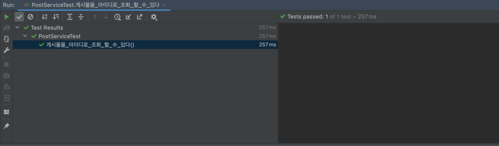
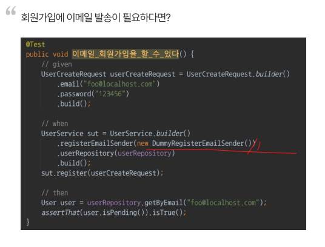
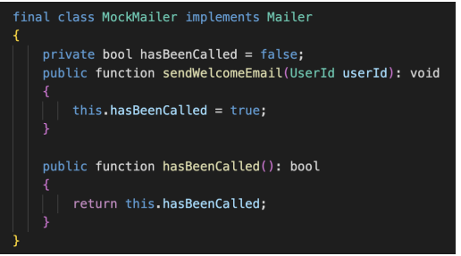
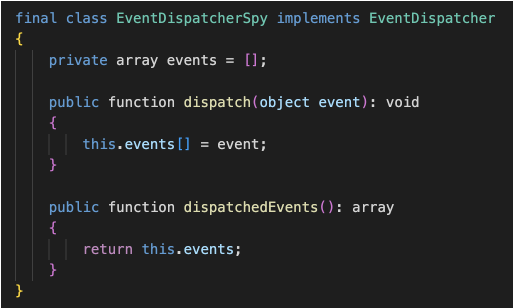
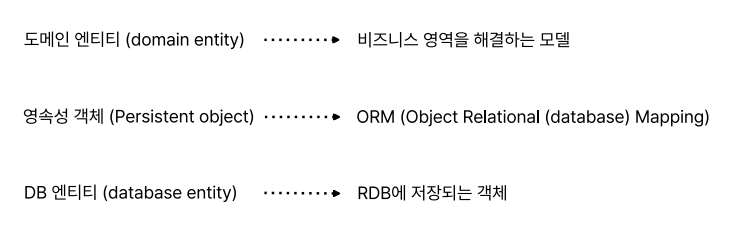
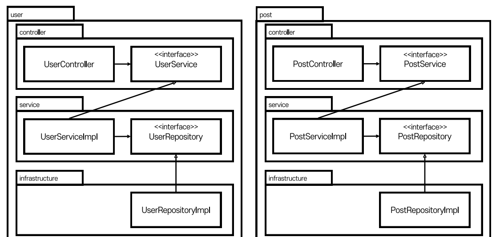

# Toy for test on spring!

해당 레포지토리는 테스트 코드 추가를 위한 토이 프로젝트 입니다.
코드가 얼마나 정상 동작하는지, 프로덕션에서 잘 동작하는지를 검증하지는 말아주세요.
스프링에 테스트를 넣는 과정을 보여드리기 위해 만들어진 레포지토리입니다.
당연히 완벽하지 않습니다.

## 실행하기

### 00. 바로 시작

h2를 이용하여 `auto create table`을 하고 있기 때문에 바로 실행이 가능합니다.

### 01. 이메일 인증

> 단 이 프로젝트는 사용자가 가입할 때 이메일 인증을 하기위해 메일을 발송하는 코드가 있습니다.

이메일이 제대로 발송되는지 확인해보고 싶으신 분들은 [해당 document 파일](./document/connect-mail-sender.md)을 따라해주세요.
관련된 자료는 라이브러리나 Gmail 정책에 따라 UI와 방법이 달라질 수 있습니다.
최신화 된 정보를 제공하지 않으니, 가급적 문서를 참조해주시고, contribution 해주시면 감사하겠습니다.

## 관리 도구로 바로가기

- [h2-console](http://localhost:8080/h2-console)
- [Openapi-doc](http://localhost:8080/swagger-ui.html)

* # 내가 하는 TDD는 왜 실패하는가 ?
  * ## 테스트의 목적
    * ### 1 . 회귀 버그 방지
    * ### 2 . 유연한 설계로 개선
      * #### 2-1 . 테스트를 쉽게 만들어줌
      * #### 2-2 . 테스트를 결정적이게 만들어줌
  * ## 커버리지를 올리기 위한 mock 프레임워크 사용법 < 왜 테스트를 해야하고, 어떻게 테스트 해야하는지 고민해야함
  * ## 방향성
    * ### TDD를 논하기 전에 테스트가 가능한 구조로 변경 되어야 함

* # 테스트에 대한 개요와 개발자가 해야할 고민
  * ## 테스트란 ?
    * ### 인수 테스트 : 사람이 직접 사용해 보면서 준비된 체크리스트를 체크하는 인수 테스트
    * ### 자동 테스트 : 테스트 코드라고 불리는 미리 짜여진 코드를 돌려서 결과값이랑 예상한 값을 비교하는 자동 테스트
  * ## TDD란 ?
    * 
      * ### 레드 단계 : 호출하는 메서드 쪽에서 일부러 예외를 던지게 되어있음 -> 테스트가 실패하는지까지 확인해야함
      * ### 그린 단계 : 예외를 없애고 실제 구현을 함
      * ### 블루 단계 : 리팩토링을 함 why? 그린 단계에서 성공을 했기 때문에 / 리팩토링을 해도 테스트를 돌려보면됨
      * ### TDD -> 이 3가지를 무한반복 하는 것
    * ### RED 단계 
      * 
      * 
        * ### 일단 컴파일이 되는 코드를 만들고 테스트가 실패하는지까지 확인해야함 -> 개발자는 구현체를 만드는 것보다, 인터페이스를 만드는 것에 집중하게됨 (객체들이 어떤 책임을 지고, 이 객체는 어디까지 해줘야하는지 생각 알고리즘이 아닌)
          * ### -> 행동에 집중한다는 것
    * ### GREEN 단계
      * 
      * 
    * ### BLUE 단계 -> 리팩토링
      * 
    * ### 테스트 주도 개발의 장단점
      * ### 장점 1 . 꺠지는 테스트를 먼저 작성해야하기 때문에, 인터페이스를 먼저 만드든 것이 강제된다.
        * ### -> 행동에 집중하게됨 (객체 지향의 핵심 원리 중 하나)
        * ### What/Who 사이클
          * ### -> 어떤 행위(What)를 누가(Who) 수행할지 결정하는 과정 -> TDD가 도와줌
      * ### 장점 2 . 장기적인 관점에서 개발 비용 감소
      * ### 단점 1 . 초기 개발비용
      * ### 단점 2 . 난이도
  * ## 개발자의 고민
    * ### 고민 1. 무의미한 테스트 (Recap)
      * 
        * #### 솔직히 이런건 JPA 구현체측에서 알아서 잘 테스트 해줬을거임
    * ### 고민 2. 느리고 쉽게 깨지는 테스트
      * 
        * #### 테스트용 DB -> h2 : MySQL이나 Oracle 같은 RDB를 InMemory에 잠깐 띄워서 테스트 같은걸 하게 해주는 솔루션
        * #### 내장 DB를 사용함으로써 테스트 매우 무거워짐
    * ### 고민 3. 테스트가 불가한 코드
      * 
      * 
        * #### 강제로 mock라이브러리르 사용하면 어떻게든 해결이 되겠지만 하지만 이건 테스트가 신호를 보내고 있는 것
        * #### 테스트가 신호를 보낸다 ?
          * #### -> 테스트를 못하는 상황이 발생한다는 것은 설계가 잘못되었다는 거라고 신호를 보내는거임
          * #### -> 하지만, 이 기회를 포착하지 않고, mock 라이브러리를 이용해 강제로 테스트를 넣는다면 설계를 발전시킬 수 있는 기회를 놓치는 것

* # 테스트의 필요성과 테스트 3분류
  * ## 필요성
    * ### 레거시 코드 : 테스트가 없는 코드
    * ### Regression(회귀)
      * ### -> 잘 돌아가던 코드가 이번 배포로 인해서 동작하지 않는 상황
    * ### 좋은 아키텍처를 유도
      * ### 좋은 아키텍처란 ? SOLID
        * #### TEST와 SOLID는 상호보완적  
          * 
        * 
        * 
        * 
        * 
          * #### 인터페이스가 너무 많아서 뭘 호출해야 할지 모르겠는데? 이떄가 인터페이스를 분리해 줘야 하는 시점 -> 리팩터링
        * 
    * ### 어떻게 테스트할까? -> SOLID가 자연스럽게 따라옴
  * ## 테스트 3분류
    * 
    * 
      * ### 소형 테스트 
        *  
        * #### 항상 결과가 결정적(Deterministic)이고 테스트 속도가 빨라짐 / h2를 사용한 테스트는 단위 테스트가 아님
      * ### 중형 테스트
        * 
        * 
      * ### 대형 테스트
        * 
    * ### 우리가 가장 집중해야할 테스트 -> 단위 테스트 (전체 80%를 차지해야 좋은 방향성)

* # 테스트에 필요한 개념
  * ## SUT -> System under test (테스트 하려는 대상)
    * 
  * ## BDD -> (given - when - then)
    * 
  * ## 상호 작용 테스트 (Interaction test) -> 대상 함수의 구현을 호출하지 않으면서 그 함수가 어떻게 호출되는지를 검증하는 기법
    * 
      * ### 상호 작용 테스트보다는 상태를 테스트하는게 좋음
  * ## 상태 검증 vs 행위 검증
    * ### 상태 기반 검증 (state-based-verification) -> 어떤 값을 시스템에 넣었을 떄, 나오는 결과값을 기댓값과 비교하는 방식
      * 
    * ### 행위 기반 검증 (behaviour-based-verification) == 상호 작용 테스트 -> 어떤 값을 시스템에 넣었을 떄, 협력 객체의 어떤 메서드를 실행하는가 ?
      * 
  * ## 테스트 픽스처 -> 테스트에 필요한 자원을 생성하는 것, SUT가 될 수도 있고, SUT에 들어가야 하는 의존성 일부가 될 수도 있음
     *  
  * ## 비욘세 규칙 (테스트는 정책이고 계약)
    * ### 유지하고 싶은 상태가 있으면 전부 테스트로 작성할 것 -> 이게 곧 정책이 됨
      * ####  ex) 유저 아이디가 이메일 형식이길 원하면 유저 아이디가 이메일이 아닐 떄, 예외를 던지는 테스트를 작성하면됨
  * ## Testability
    * ### 테스트 가능성, 소프트웨어가 테스트 가능한 구조인가?
  * ## test double = 테스트 대역 
    * 
  * ## 대역 - Dummy -> 아무런 동작도 하지 않고, 그저 코드가 정상적으로 돌아가기 위해 전달하는 객체
    * 
  * ## 대역 - Fake -> Local에서 사용하거나 테스트에서 사용하기위해 만들어진 가짜 객체, 자체적인 로직이 있다는게 특징
    * 
  * ## 대역 - Stub -> 미리 준비된 값을 출력하는 객체  
    * 
    * 
      * ### mockito 프레임워크를 이용
  * ## 대역 - Mock -> 메서드 호출을 확인하기 위한 객체, 자가 검증 능력을 갖춤, 사실상 테스트 더블과 동일한 의미로 사용됨
    * 
  * ## 대역 - Spy -> 메서드 호출을 전부 기록했다가 나중에 확인하기 위한 객체
    * 

* # 의존성과 Testability
  * ## 의존성 ?
    * ### A는 B를 사용하기만 해도 A는 B에 의존한다 할 수 있음
  * ## 의존성 주입 ? -> 의존성을 약화시키는 테크닉
    * 
      * ### 인스턴스를 만드는 것보다 의존성 주입을 받는게 더 좋은 이유 -> new는 사실상 하드 코딩이다
  * ## 의존성 역전 != 의존성 주입
    * ### 의존성 역전 ? -> 화살표의 방향을 바꾸는 테크닉
      * 
      * 
        * #### 정책 : 인터페이스나 추상 클래스
        * #### 세부사항 : 변동성이 큰 구체적인 요소
      * 
        * #### 인터페이스나 추상클래스 같은 추상적인 선언만을 참조해야함, 의존하지 않도록 피하고자 하는 것은 바로 변동성이 큰 구체적인 요소
  * ## 의존성과 테스트
    * ### 테스트를 잘할려면 1) 의존성 주입과 2) 의존성 역전을 잘 다룰 수 있어야함
      * 
      * 
        * #### 일반적으로 의존성이 숨겨져 있으면 안좋은 신호임 why? -> 테스트 하기 힘듬
        * #### 테스트가 mock 프레임워크 없이는 불가능한데? -> 테스트가 보내는 신호 (어떻게 해결해야함)
      * 
        * #### 시간을 의존성 주입으로 해결 -> 의존성 주입을 외부에서 받도록 하게 해야함
        * #### 즉 1. 의존성이 숨겨져 있으면 테스트 하기 힘들다 2. 의존성은 드러내는게 좋다
      * 
      * 
        * #### 하지만 결국엔 호출하는 쪽에선 똑같은 문제가 생김
        * #### 폭탄만 넘겨줬을 뿐, 어딘가에선 고정된 값을 넣어줘야함
      * 
      * 
      * 
      * 
        * #### 의존성 주입 + 의존성 역전으로 해결
      * 
        * #### 프로덕션 환경에서는 스프링을 쓴다면 알아서 잘 주입해줌 -> 의존성 역전은 배포 환경과 테스트 환경을 분리시켜줌
    * ### SOLID -> DIP : 의존성 역전 원칙 (대부분의 소프트웨어 문제는 의존성 역전으로 해결이 가능함)
  * ## Testability
    * ### 테스트 가능성 -> 얼마나 쉽게 input을 변경하고, output을 쉽게 검증할 수 있는가 ?
      * 
      * 
      * 
      * 
      * 
      * 
      * 
        * #### final 클래스,final 메서드-> stub을 지원해선 안됨, final를 클래스에 선언을 했다는 것은 "나는 이 코드를 더 이상 변경할 수 없게 할거야"라는 선언을 했기 때문
        * #### final메서드나 클래스를 stub해야 한다는 상황이 생기면 피해야함 -> 의존성 역전 원칙 적용해볼 것
      * 
      * 
* # 실기 전 필요한 지식들
  * ## 빌더 패턴 -> 생성자가 지나치게 많아지는 문제를 해결할 수 있는 유연한 해결책
    * 
    * 
      * ### 단점도 존재함, 그냥 생성자를 사용하면 매개변수를 미입력시 컴파일 에러가 나지만 빌더는 컴파일 에러가 발생하지 않음
    * 
    * 
    * 
    * 
  * ## 엔티티 
    * ### 도메인 엔티티와 DB 엔티티는 다르다 
      * #### 도메인 엔티티 ->  소프트웨어에서 어떤 도메인이나 문제를 해결하기 위해 만들어진 모델, 비즈니스 로직을 들고 있고, 식별 가능하며, 일반적으로 생명 주기를 갖음
      * #### DB 엔티티 -> 데이터베이스 분야에서 개체 또는 엔티티라고 하는 것은 데이터베이스에 표현하려고 하는 유형, 무형의 객체로써 서로 구별되는 것을 뜻함
      * 
      * 
        * #### 같은 목적을 해결하기 위해 미묘하게 다른 영역에서 엔티티라는 개념을 사용해옴
          * #### -> 이 둘을 맵핑해주는 역할만 전담하는 다른 엔티티가 필요하게 되었음
          * 
      * 
      * 
        * #### 영속성 객체(ORM) : 관계형 DB에 있는 데이터를 객체로 매핑해주는 녀석
      * 
  * ## 기타 조언
    * ### private / final 메서드 테스트 해야함 ?
      * ### NO, private 메서드를 테스트하고 싶은 느낌이 든다면, 사실 private 메서드가 아니어야 한다는 의미거나, 다른 클래스로 분리/책임을 위임하여 public으로 만들라는 신호임
      * ### final 메서드를 stub하는 상황을 피해야 함 -> 잘못된 설계
        * 
        * 
          * #### final class란 이 클래스를 대체 할 수 없게 하겠다는 선언임
          * #### 의존성 역전으로 완충재를 둬야함
        * 
        * 
          * #### 지정한 값을 내려주도록 할 수 있음
    * ### DRY < DAMP
      * #### 테스트와 코드 공유 : DRY가 아니라 DAMP!
        * 
    * ### 논리 로직을 피하라 (+, for, if ...)
      * #### 테스트에 논리를 넣지 말자


* # 방향성 탐색 1 . 레이어드 아키텍처의 문제점과 해결책
  * ## h2
    * ### h2를 사용하는 순간 중형테스트, 현재 시스템에선 소형테스트가 없음 -> 설계가 잘못되었다는것
  * ## 레이어드 아키텍처 -> 유사한 기능들을 같은 계층으로 묶어 관리하는 방식의 아키텍처 구조
    * 
    * ### 장점 -> 기능 개발을 할 때 가시적인 무언가를 만들기에 가장 쉬운 방법 
    * ### 단점 1 . 계층형 아키텍처는 데이터베이스 주도 설계를 유도 -> DB 주도 설계
      * #### 만약 주문 시스템을 만들어야 한다면 ?
        * 
          * #### 테이블이 어떻게 생겨야 하는지, 어떤 값을 가져아하는지 보다 주문 시스템에 필요한 Use case를 파악하는게 먼저임
        * 
          * ### 주문 시스템의 주문하기, 주문 내역 확인, 주문 취소 같은 것들을 먼저 파악해서 이를 처리하기 위한 도메인과, 도메인들의 관계를 생각하는게 먼저여야 하는 것
    * ### 단점 2 . 동시 작업이 쉽지않음
      * 
    * ### 단점 3 . 도메인이 죽음
      * 
        * #### 계층형 아키텍처는 업무 도메인에 대해 아무것도 말해주지 않음 
        * #### Service(Application) 계층은 사실상 모든 일을 다 처리하는 신과 같은 존재가 되어버림
    * 
  * ## 개선된 아키텍처
    * 
    * 
    * 
      * ### Service가 하던 역할을 도메인이 처리하도록 위임
      * ### Repository에서 도메인을 가져와 도메인에게 일을 시키는 역할을 하게 만들 것임
    * 
      * ### 도메인 모델을 lombok을 제외한 애노테이션이 없는 오브젝트로 만들것 why ? 도메인 엔티티와 영속성 객체를 구분하기 위해
    * 
      * ### 도메인 입장에서는 계층을 넘나드는 의존을 하지 않음(나가는 화살표가 없음) -> 도메인 테스트시 계층 간 의존성을 위해 Mocking을 할 필요가 없어짐(Testability가 높음)
    * 
      * ### Repository도 마찬가지로 Mocking할 필요없음(계층간 연결된 의존성이 없음)
      * ### JpaReopsitory는 굳이 테스트? No why? Repository가 쿼리를 제대로 만들어주는지는 JPA측에서 알아서 테스트하기 때문
    * 
      * ### Service에서는 2개의 의존성 
      * ### -> 1. 도메인 (인스턴스화 하는게 어렵지않음) 
      * ### -> 2 . Repository ( JPA코드를 사용하고 있고 DB와 강결합 되어 있음 그래서 JpaRepository를 인스턴스화하는 것은 h2 같은 embedded DB없이는 어려움)
    * 
    * 
      * ### 그래서 어떻게 해결? 의존성으로 발생하는 문제는 의존성 역전을 활용하면 해결됨
      * ### 해당 개선을 통해 테스트할 떄 Fake를 사용하게 함으로써, Testability를 높일 수 있게됨
      * ### Service레이어는 영속성 계층과의 의존 관계가 매우 약해짐
    * 
    * 
    * 
      * ### 코드를 보면 서비스는 Repository에게 질의를 했을 떄 필요한 도메인을 내려주는 녀석, 정도로만 알고 있을거임
    * 
    * 
    * 
      * ### Controller는 총 3개 의존성을 가짐 (Service, Domain, Repository)
      * ### 컨트롤러를 테스트하기 위해서 3개의 의존성을 모두 준비하는 것은 시간낭비, 자원낭비임
      * ### Service Layer도 의존성 역전을 적용 -> 테스트할 떄 Service에 대응되는 Fake나 Mock을 Service 구현체로 두게 함으로써 컨트롤러를 테스트하기 쉽게 만들 수 있음
    * 
* # 방향성 탐색 2 . 어떻게 변경할 것인가 ?
  * ## 테스트의 범위
    * 
      * ### ServiceImpl과 Domain만을 집중적으로 테스트 -> 전체 애플리케이션을 테스트하기 위한 '최소 조건'
    * 
      * ### Controller와 RepositoryImpl은 프레임워크와 라이브러리들이 잘해줄 것임
    * ### 이 둘을 test를 하지 않으면 커버러지가 낮아짐 
      * #### 하지만 집중해야 하는 테스트 -> 본질
      * 
  * ## 실기 전 추가사항
    * ### 의존성 역전 원리를 이용하여 외부를 다룰 것임 -> 인프라 서비스 추상화 (jpa, http통신, 이메일 발송)
      * #### 의존성 역전은 의존 관계를 약화시킨다는 의미, 호출자와 구현체를 독립적으로 구성하겠다라는 의미 -> 테스트 가능성을 높임
        * 
        * 
        * 
        * 
    * ### 필요한 경우 mock으로 치환하여 테스트
      * 
      * 
    * ### 리팩토링 a. 패키지 관리
      * #### layer로 분류
        * 
        * 
      * #### domain/layer로 분류 (repository -> infrastructure)
        * 
        * 
        * 
    * ### 리팩토링 a. 패키지 관리 + 의존성 역전
      * 
      * 
      * 
    * ### 리팩토링 b. 패키지 의존성
      * 
      * 
        * #### 순환 참조가 생기는지 의식하며 개발해야함 (클래스 간, 패키지 간)
    * ### 리팩토링 c. Jpa 엔티티와 도메인 모델을 분리
      * 
    * ### 리팩토링 d. setter를 없애고 domain/vo으로 로직 이동
      * 
      * 
      * 
      * 
    * ### 리팩토링 e. CQRS (Command and Query Responsibility Segregation)
      * #### 명령과 질의의 책임 분리
      * #### 메서드를 명령과 질의로 나누자. (더 넓게는 클래스까지도)
      * 
      * 
      * 
      * 


* # 실기 1 ->  회귀 버그를 잡는 대상으로 두고 개발
  * 
    * ### jpa와 h2 연결 테스트
  * 
    * ### 테스트 메서드가 병렬로 처리되는데 동시성 제어가 안됨 -> sava하는 코드들 중복 
  * 
  * 
  * 
    * ### @Sql애노테이션을 활용하여 테스트 전에 값을 미리 준비하여 테스트할 땐 준비된 값을 사용
  * ## UserService 리팩터링
    * ### get은 애초에 데이터가 없으면 에러를 던진다는 의미가 내포되어 있음
      * 
      * 
  * ## UserServiceTest
    * ### 두번쨰 테스트 진행시 데이터가 이미 있어서 충돌 발생 
      * 
    * ### Repository 테스트에서는 @DataJpaTest가 자동으로 롤백해줬기 때문에 가능했던것
    * ### 해결 -> @SqlGroup 사용
      * #### @SqlGroup에서는 Sql 파일을 여러 개 지정해서 실행시킬 수 있음
      * 
      * 
    * ### JavaMailSender를 더미로 대체
      * #### SimpleMailMessage를 사용하는 send가 호출돼도 아무것도 하지말라는 코드
        * 
      * #### JavaMailSender라는 Bean객체를 Mock으로 선언된 객체로 덮어쓰기 하는것
        * 
  * ## ObjectMapper
    * 
    * 

* # 실기 2 -> 구조적 변화를 주는 테스트 코드
  * ## UserCreateDto, UserUpdateDto들은 Service패키지에서 참조해야 하므로 domain패키지로 이동
  * ## UserRepository를 infrastructure에 두면 상위 모듈인 service에서 infrastructure인 패키지에 의존하는 그림이 되게 되는데 그렇게 되면 안되기 떄문에
    * ### -> service 쪽으로 이동
    * ### service에서 사용하는 인터페이스들을 port패키지에 몰아 넣어줌
  * 
    * ### MailSender를 주입해줘야하는데 fake로 만들어줌
    * ### 실제로 어떤 값이 들어왔는지 볼 수 있게 멤버변수 선언
      * 
      * 
  * ## 도메인과 영속성 객체를 구분해서 우리의 시스템을 외부 시스템과 완전히 독립적이게 구성이 가능
    * ### User 도메인에서 영속성 객체로 바꿔주는 방법 -> X 도메인은 인프라 레이어의 정보를 모르는 것이 좋기 때문
      * 
      * 
    * ### 로그인 로직 -> 저장까지 진행 why? 변경한 객체가 도메인 객체이기 때문에
      * #### 원래는 Transactional로 묶여있어서 jpa가 알아서 변경된 엔티티를 감지하고 수정하는데 jpa와의 의존성이 끊어지면서 변경감지를 못함
        * 
        * 
    * ### 컨트롤러가 Http 응답으로 맵핑해주는 로직을 들고 있는게 부자연스러움 -> 응답 객체에 책임을 넘겨줌
      * 
      * #### Setter를 제거해주고 Builder 애노테이션을 추가
        * 
      * #### 컨트롤러 간에 있던 이상한 의존성도 사라짐
        * 
  * ## 도메인에 테스트 추가하기
    * ### 서비스에서 사용할 인터페이스의 구현체를 외부에서 주입받도록 함
      * 
      * 
      * 
    * ### 테스트 하기 위한 Fake
      * 
      * 
  * ## 서비스를 소형 테스트로 만들기
    * ### 데이터베이스처럼 자동으로 증가하는 id값이 필요함 -> AtomicLong을 이용해서 카운트 관리
      * 
    * ### save를 했을 떄 데이터를 저장해야함 -> 데이터가 저장될 배열 멤버변수로 선언
      * #### 혹시 모르는 병렬 처리를 대비해서 synchronizedList로 선언해줌 -> 근데 소형 테스트는 단일 스레드에서 돌아가기 때문에 동기화를 걱정할 필요가 없음
        * 
    * ### JPA 동작 원리 중 하나인 Id값이 null이거나 0이면 insert 하고 그렇지 않으면 update하는 방식임 -> Fake에 유사하게 구현
      * #### 만약 id 값이 있으면 기존에 있던 데이터를 지우고 들어온 데이터를 저장
        * 
    * ### UserServiceTest -> 소형테스트로 
      * #### 테스트 픽스처인 UserService를 Builder로 만들어주고 mock객체들을 주입시켜줌
        * 
        * 
    * ### PostServiceTest -> 소형테스트로
      * #### 해당 프로젝트에서는 userService 전부에 의존하는게 아니라 userRepository에만 의존하게 바꿔도 될듯함
        * 
          * #### 하지만 해당 작업은 UserService를 또 구현해서 넣어주는게 귀찮아서 그냥 Repository에 의존하게 바꿔준거임
          * #### MailSender나 Uuid 같은 건 게시물 작성할 떄 쓰지도 않는데 번거롭기 때문 -> 테스트가 신호를 보낸 것 (의존성을 줄이라고)
        * 
  * ## 컨트롤러를 소형 테스트로 만들기
    * ### 서비스를 Fake로 만들기엔 너무 번거러움 -> Service를 분리
      * 
      * 
      * 
    * ### UserControllerTest
      * #### 이렇게 stub(미리 준비된 값을 출력하는 것)하는 코드는 별로 -> 애초에 어떤 하위 클래스에 어떤 메서드가 호출되면 "이런 응답을 내려줘야 한다"라는 것 자체가 구현을 강제하는 것
    ```java
          @Test
          public void 사용자는_특정_유저의_정보를_개인정보는_소거된채_전달_받을_수_있다() throws Exception {
            // given
             UserController userController = UserController.builder()
                            .userReadService(new UserReadService() {
           @Override
                 public User getByEmail(String email) {
                  return null;
          }

          @Override
          public User getById(long id) {
              return User.builder()
                      .id(id)
                      .email("0711kyungh@naver.com")
                      .nickname("lok22")
                      .address("Seoul")
                      .certificationCode("aaaaaa-aaaaaa-aaaaaaa")
                      .status(UserStatus.ACTIVE)
                      .build();
          }
          }).build();
  
          // when
          ResponseEntity<UserResponse> result = userController.getUserById(1);

          // then
          assertThat(result.getStatusCode()).isEqualTo(HttpStatusCode.valueOf(200));
          assertThat(result.getBody()).isNotNull();
          assertThat(result.getBody().getId()).isEqualTo(1);
          assertThat(result.getBody().getEmail()).isEqualTo("0711kyungh@naver.com");
          assertThat(result.getBody().getNickname()).isEqualTo("lok22");
          assertThat(result.getBody().getStatus()).isEqualTo(UserStatus.ACTIVE);
       }
  
      @Test
      public void 사용자는_존재하지_않는_유저의_아이디로_api_호출할_경우_404_응답을_받는다() throws Exception {
      // given
      UserController userController = UserController.builder()
      .userReadService(new UserReadService() {
      @Override
      public User getByEmail(String email) {
      return null;
      }

                      @Override
                      public User getById(long id) {
                          throw new ResourceNotFoundException("Users", id);
                      }
                  }).build();
          // when
          // then
          assertThatThrownBy(() -> {
              userController.getUserById(123445);
          }).isInstanceOf(ResourceNotFoundException.class);
      }
     ```
     
    * ### 롤백을 진행
      * #### 대신에 TestContainer를 만들어서 스프링의 IoC 컨테이너를 흉내내는 코드를 작성
      * #### CertificationService는 controller같은 외부 호출이 없으니 굳이 추상화 안해도 될듯
       *    
       * 
       * 
      * #### UserController도 번거러움으로 TesetContainer에 추가
        * 
      * #### 고정된 시간만 내려주는 형태의 코드는 시간이 변경되었을 때 다른 동작을 가져야 하는 비즈니스 로직을 테스트하기 어려울 수 있음
        * #### 테스트 중간중간에 원하는 시간대와 원하는 Uuid 값으로 바뀌게 할 수 있고, 시간 변화에 따른 비즈니스 로직 테스트를 할 수 있게 됨
          * 
          * 
        * #### 테스트 케이스에서 TestClockHolder/TestUuidHolder를 다루기 위해 TestContainer아래와 같이 변경하는 것이 좋을 것임
          * 
        
  * ## 마지막 리팩토링
    * ### TestContainer를 쓰므로 UserService를 UserCreateService, UserReadService, UserUpdateService, AuthenticationService로 분리한 것이 필요 없을듯
      * 
      * 
      * 
    * ### UserUpdate 도메인이 사용자한테 노출되어 있음
      * #### user/controller/request 패키지를 만들어서 Http요청만 전문적으로 처리하는 UserUpdateRequest를 생성해서 애가 UserUpdate로 맵핑하는 도메인을 반환하는 메서드 작성
        * 
    * ### 컨트롤러 메서드의 반환타입이 다르다 ? -> 책임이 제대로 분할이 안된 것 (UserController의 메서드 중 반환타입이 ResponseEntity<MyProfileResponse>인 메서드를 MyInfoController클래스를 생성하여 분리)
      * 